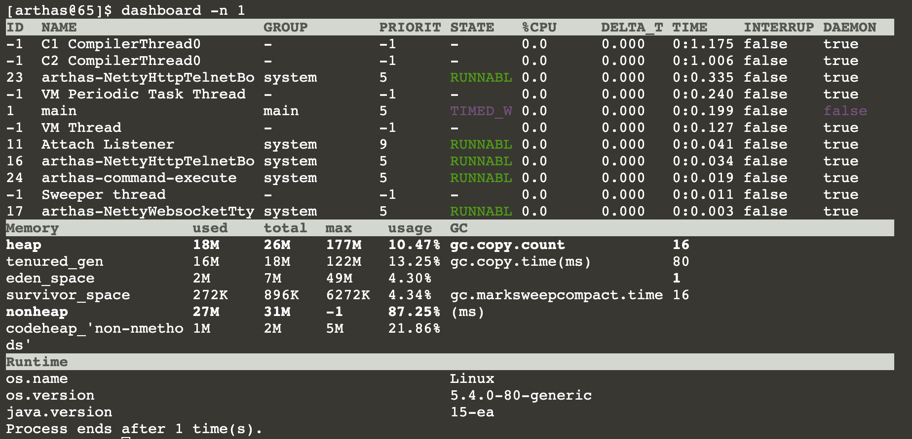
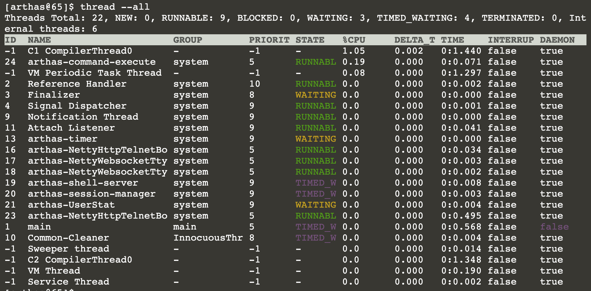
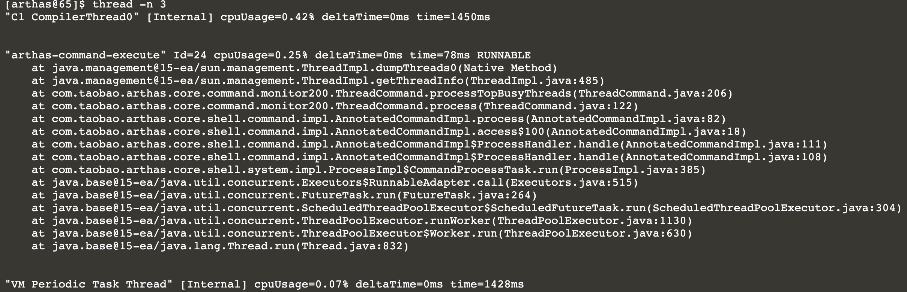

# Arthas 3.5.5 使用

## 简介

```javascript
1. 下载地址
	https://github.com/alibaba/arthas/releases
2. 在线文档
	https://arthas.aliyun.com/doc
3. idea 插件
	Jetbrains 插件获取地址： https://plugins.jetbrains.com/plugin/13581-arthas-idea
	使用文档：https://www.yuque.com/arthas-idea-plugin
	源码地址： https://github.com/WangJi92/arthas-idea-plugin
4. 用户案例
	https://github.com/alibaba/arthas/issues?q=label%3Auser-case
```

## 数据面板：dashboard

当前系统的实时数据面板，会显示当前java进程相关的信息，包括线程信息、内存信息、系统信息

### 命令

```sh
[arthas@65]$ dashboard -h
 USAGE:                                                                                             
   dashboard [-h] [-i <value>] [-n <value>]                                                         
                                                                                                    
 SUMMARY:                                                                                           
   Overview of target jvm's thread, memory, gc, vm, tomcat info.                                    
                                                                                                    
 EXAMPLES:                                                                                          
   dashboard                                                                                        
   dashboard -n 10                                                                                  
   dashboard -i 2000                                                                                
                                                                                                    
 WIKI:                                                                                              
   https://arthas.aliyun.com/doc/dashboard                                                          
                                                                                                    
 OPTIONS:                                                                                           
 -h, --help                       this help                                                         
 -i, --interval <value>           The interval (in ms) between two executions, default is 5000 ms.  
 -n, --number-of-execution <valu  The number of times this command will be executed.  

```
### 参数说明
| 参数名称 | 参数说明                                |
| -------- | --------------------------------------- |
| [i:]     | 刷新实时数据的时间间隔 (ms)，默认5000ms |
| [n:]     | 刷新实时数据的次数                      |

### 截图



### 解释

| ID          | Java级别的线程ID，注意这个ID不能跟jstack中的nativeID一一对应 |
| ----------- | ------------------------------------------------------------ |
| NAME        | 线程名                                                       |
| GROUP       | 线程组名                                                     |
| PRIORITY    | 线程优先级, 1~10之间的数字，越大表示优先级越高               |
| STATE       | 线程的状态                                                   |
| CPU%        | 线程的cpu使用率。比如采样间隔1000ms，某个线程的增量cpu时间为100ms，则cpu使用率=100/1000=10% |
| DELTA_TIME  | 上次采样之后线程运行增量CPU时间，数据格式为`秒`              |
| TIME        | 线程运行总CPU时间，数据格式为`分:秒`                         |
| INTERRUPTED | 线程当前的中断位状态                                         |
| DAEMON      | 是否是daemon线程                                             |

## 线程：thread

查看当前线程信息，查看线程的堆栈

### 命令

```sh
[arthas@65]$ thread -h
 USAGE:                                                                                             
   thread [--all] [-h] [-b] [--lockedMonitors] [--lockedSynchronizers] [-i <value>] [--state <value 
 >] [-n <value>] [id]                                                                               
                                                                                                    
 SUMMARY:                                                                                           
   Display thread info, thread stack                                                                
                                                                                                    
 EXAMPLES:                                                                                          
   thread                                                                                           
   thread 51                                                                                        
   thread -n -1                                                                                     
   thread -n 5                                                                                      
   thread -b                                                                                        
   thread -i 2000                                                                                   
   thread --state BLOCKED                                                                           
                                                                                                    
 WIKI:                                                                                              
   https://arthas.aliyun.com/doc/thread                                                             
                                                                                                    
 OPTIONS:                                                                                           
     --all                        Display all thread results instead of the first page              
 -h, --help                       this help                                                         
 -b, --include-blocking-thread    Find the thread who is holding a lock that blocks the most number 
                                   of threads.                                                      
     --lockedMonitors             Find the thread info with lockedMonitors flag, default value is f 
                                  alse.                                                             
     --lockedSynchronizers        Find the thread info with lockedSynchronizers flag, default value 
                                   is false.                                                        
 -i, --sample-interval <value>    Specify the sampling interval (in ms) when calculating cpu usage. 
     --state <value>              Display the thead filter by the state. NEW, RUNNABLE, TIMED_WAITI 
                                  NG, WAITING, BLOCKED, TERMINATED is optional.                     
 -n, --top-n-threads <value>      The number of thread(s) to show, ordered by cpu utilization, -1 to show all.                                                       
 <id>                             Show thread stack
```

### 参数说明

| 参数名称      | 参数说明                                             |
| ------------- | ---------------------------------------------------- |
| *id*          | 线程id                                               |
| [n:]          | 指定最忙的前N个线程并打印堆栈                        |
| [b]           | 找出当前阻塞其他线程的线程                           |
| [i `<value>`] | 指定cpu使用率统计的采样间隔，单位为毫秒，默认值为200 |
| [--all]       | 显示所有匹配的线程                                   |

### 截图





- 没有线程ID，包含`[Internal]`表示为JVM内部线程，参考[dashboard](https://arthas.aliyun.com/doc/dashboard.html)命令的介绍。

### 解释

| cpuUsage  | 采样间隔时间内线程的CPU使用率，与dashboard命令的数据一致 |
| --------- | ------------------------------------------------------------ |
| deltaTime | 采样间隔时间内线程的增量CPU时间，小于1ms时被取整显示为0ms    |
| time      | 线程运行总CPU时间                                            |

## 环境变量：sysenv

### 命令

```sh
[arthas@42]$ sysenv -h
 USAGE:                                                                                             
   sysenv [-h] [env-name]                                                                           
                                                                                                    
 SUMMARY:                                                                                           
   Display the system env.                                                                          
                                                                                                    
 EXAMPLES:                                                                                          
   sysenv                                                                                           
   sysenv USER                                                                                      
                                                                                                    
 WIKI:                                                                                              
   https://arthas.aliyun.com/doc/sysenv                                                             
                                                                                                    
 OPTIONS:                                                                                           
 -h, --help                       this help                                                         
 <env-name>                       env name
```

### 参数说明

### 截图


## 系统属性：sysprop

### 命令

```sh
[arthas@42]$ sysprop -h
 USAGE:                                                                                             
   sysprop [-h] [property-name] [property-value]                                                    
                                                                                                    
 SUMMARY:                                                                                           
   Display, and change the system properties.                                                       
                                                                                                    
 EXAMPLES:                                                                                          
   sysprop                                                                                          
   sysprop file.encoding                                                                            
   sysprop production.mode true                                                                     
                                                                                                    
 WIKI:                                                                                              
   https://arthas.aliyun.com/doc/sysprop                                                            
                                                                                                    
 OPTIONS:                                                                                           
 -h, --help                       this help                                                         
 <property-name>                  property name                                                     
 <property-value>                 property value 
```

### 参数说明

### 截图


## jvm信息：jvm

### 命令

```sh
[arthas@42]$ jvm -h
 USAGE:                                                                                             
   jvm [-h]                                                                                         
                                                                                                    
 SUMMARY:                                                                                           
   Display the target JVM information                                                               
                                                                                                    
 WIKI:                                                                                              
   https://arthas.aliyun.com/doc/jvm                                                                
                                                                                                    
 OPTIONS:                                                                                           
 -h, --help                       this help
```

### 参数说明

### 截图


## 日志: logger

### 命令

```sh
USAGE:                                                                                             
   logger [-c <value>] [--classLoaderClass <value>] [-h] [--include-no-appender] [-l <value>] [-n < 
 value>]                                                                                            
                                                                                                    
 SUMMARY:                                                                                           
   Print logger info, and update the logger level                                                   
                                                                                                    
 Examples:                                                                                          
   logger                                                                                           
   logger -c 327a647b                                                                               
   logger -c 327a647b --name ROOT --level debug                                                     
   logger --include-no-appender                                                                     
                                                                                                    
 WIKI:                                                                                              
   https://arthas.aliyun.com/doc/logger                                                             
                                                                                                    
 OPTIONS:                                                                                           
 -c, --classloader <value>        classLoader hashcode, if no value is set, default value is System 
                                  ClassLoader                                                       
     --classLoaderClass <value>   The class name of the special class's classLoader.                
 -h, --help                       this help                                                         
     --include-no-appender        include the loggers which don't have appenders, default value fal 
                                  se                                                                
 -l, --level <value>              set logger level                                                  
 -n, --name <value>               logger name
```

### 参数说明

| 参数        | 说明     |
| ----------- | -------- |
| classloader | 类加载器 |
| level       | 日志级别 |
| name        | 名称     |


### 截图


## vm工具：vmtool

### 命令

```sh
[arthas@42]$ vmtool -h
 USAGE:                                                                                             
   vmtool -a {forceGc, getInstances} [-c <value>] [--classLoaderClass <value>] [--className <value> 
 ] [-x <value>] [--express <value>] [-h] [--libPath <value>] [-l <value>]                           
                                                                                                    
 SUMMARY:                                                                                           
   jvm tool                                                                                         
                                                                                                    
 EXAMPLES:                                                                                          
   vmtool --action getInstances --className demo.MathGame                                           
   vmtool --action getInstances --className demo.MathGame --express 'instances.length'              
   vmtool --action getInstances --className demo.MathGame --express 'instances[0]'                  
   vmtool --action getInstances --className demo.MathGame -x 2                                      
   vmtool --action getInstances --className java.lang.String --limit 10                             
   vmtool --action getInstances --classLoaderClass org.springframework.boot.loader.LaunchedURLClass 
 Loader --className org.springframework.context.ApplicationContext                                  
   vmtool --action forceGc                                                                          
                                                                                                    
 WIKI:                                                                                              
   https://arthas.aliyun.com/doc/vmtool                                                             
                                                                                                    
 OPTIONS:                                                                                           
 -a, --action <value>             Action to execute                                                 
 -c, --classloader <value>        The hash code of the special class's classLoader                  
     --classLoaderClass <value>   The class name of the special class's classLoader.                
     --className <value>          The class name                                                    
 -x, --expand <value>             Expand level of object (1 by default)                             
     --express <value>            The ognl expression, default valueis `instances`.                 
 -h, --help                       this help                                                         
     --libPath <value>            The specify lib path.                                             
 -l, --limit <value>              Set the limit value of the getInstances action, default value is  
                                  10, set to -1 is unlimited 
```

### 参数说明

| 参数        | 说明             |
| ----------- | ---------------- |
| action      | 操作             |
| classloader | 类加载器         |
| className   | 类名             |
| expand      | 对象实例展开层次 |
| limit       | 显示数量         |


### 截图


## 类加载器：classloader

### 命令

```sh
[arthas@42]$ classloader -h
 USAGE:                                                                                             
   classloader [-a] [-c <value>] [--classLoaderClass <value>] [-h] [-i] [-l] [--load <value>] [-r < 
 value>] [-t]                                                                                       
                                                                                                    
 SUMMARY:                                                                                           
   Show classloader info                                                                            
                                                                                                    
 EXAMPLES:                                                                                          
   classloader                                                                                      
   classloader -t                                                                                   
   classloader -l                                                                                   
   classloader -c 327a647b                                                                          
   classloader -c 327a647b -r META-INF/MANIFEST.MF                                                  
   classloader -a                                                                                   
   classloader -a -c 327a647b                                                                       
   classloader -c 659e0bfd --load demo.MathGame                                                     
                                                                                                    
 WIKI:                                                                                              
   https://arthas.aliyun.com/doc/classloader                                                        
                                                                                                    
 OPTIONS:                                                                                           
 -a, --all                        Display all classes loaded by ClassLoader                         
 -c, --classloader <value>        The hash code of the special ClassLoader                          
     --classLoaderClass <value>   The class name of the special class's classLoader.                
 -h, --help                       this help                                                         
 -i, --include-reflection-classl  Include sun.reflect.DelegatingClassLoader                         
 oader                                                                                              
 -l, --list-classloader           Display statistics info by classloader instance                   
     --load <value>               Use ClassLoader to load class, won't work without -c specified    
 -r, --resource <value>           Use ClassLoader to find resources, won't work without -c specifie 
                                  d                                                                 
 -t, --tree                       Display ClassLoader tree   
```

### 参数说明

| 参数 | 说明                       |
| ---- | -------------------------- |
| all  | 显示所有被类加载器加载的类 |
| load | 用类加载器加载class        |
| tree | 展示类加载器树             |

### 截图


## 类扫描：sc

### 命令

```sh
[arthas@42]$ sc -h
 USAGE:                                                                                             
   sc [-c <value>] [--classLoaderClass <value>] [-d] [-x <value>] [-f] [-h] [-n <value>] [-E] class 
 -pattern                                                                                           
                                                                                                    
 SUMMARY:                                                                                           
   Search all the classes loaded by JVM                                                             
                                                                                                    
 EXAMPLES:                                                                                          
   sc -d org.apache.commons.lang.StringUtils                                                        
   sc -d org/apache/commons/lang/StringUtils                                                        
   sc -d *StringUtils                                                                               
   sc -d -f org.apache.commons.lang.StringUtils                                                     
   sc -E org\\.apache\\.commons\\.lang\\.StringUtils                                                
                                                                                                    
 WIKI:                                                                                              
   https://arthas.aliyun.com/doc/sc                                                                 
                                                                                                    
 OPTIONS:                                                                                           
 -c, --classloader <value>        The hash code of the special class's classLoader                  
     --classLoaderClass <value>   The class name of the special class's classLoader.                
 -d, --details                    Display the details of class                                      
 -x, --expand <value>             Expand level of object (0 by default)                             
 -f, --field                      Display all the member variables                                  
 -h, --help                       this help                                                         
 -n, --limits <value>             Maximum number of matching classes with details (100 by default)  
 -E, --regex                      Enable regular expression to match (wildcard matching by default) 
 <class-pattern>                  Class name pattern, use either '.' or '/' as separator     
```

### 参数说明

| 参数    | 说明               |
| ------- | ------------------ |
| details | 类详细信息         |
| expand  | 对象实例展开层深度 |
| field   | 类字段             |

### 截图


## 方法扫描：sm

### 命令

```sh
[arthas@42]$ sm -h
 USAGE:                                                                                             
   sm [-c <value>] [--classLoaderClass <value>] [-d] [-h] [-n <value>] [-E] class-pattern [method-p 
 attern]                                                                                            
                                                                                                    
 SUMMARY:                                                                                           
   Search the method of classes loaded by JVM                                                       
                                                                                                    
 EXAMPLES:                                                                                          
   sm java.lang.String                                                                              
   sm -d org.apache.commons.lang.StringUtils                                                        
   sm -d org/apache/commons/lang/StringUtils                                                        
   sm *StringUtils *                                                                                
   sm -Ed org\\.apache\\.commons\\.lang\.StringUtils .*                                             
                                                                                                    
 WIKI:                                                                                              
   https://arthas.aliyun.com/doc/sm                                                                 
                                                                                                    
 OPTIONS:                                                                                           
 -c, --classloader <value>        The hash code of the special class's classLoader                  
     --classLoaderClass <value>   The class name of the special class's classLoader.                
 -d, --details                    Display the details of method                                     
 -h, --help                       this help                                                         
 -n, --limits <value>             Maximum number of matching classes (100 by default)               
 -E, --regex                      Enable regular expression to match (wildcard matching by default) 
 <class-pattern>                  Class name pattern, use either '.' or '/' as separator            
 <method-pattern>                 Method name pattern   
```

### 截图


## 向上调用链路：stack

### 命令

```sh
[arthas@42]$ stack -h
 USAGE:                                                                                             
   stack [--exclude-class-pattern <value>] [-h] [-n <value>] [--listenerId <value>] [-E] [-v] class 
 -pattern [method-pattern] [condition-express]                                                      
                                                                                                    
 SUMMARY:                                                                                           
   Display the stack trace for the specified class and method                                       
   The express may be one of the following expression (evaluated dynamically):                      
           target : the object                                                                      
            clazz : the object's class                                                              
           method : the constructor or method                                                       
           params : the parameters array of method                                                  
     params[0..n] : the element of parameters array                                                 
        returnObj : the returned object of method                                                   
         throwExp : the throw exception of method                                                   
         isReturn : the method ended by return                                                      
          isThrow : the method ended by throwing exception                                          
            #cost : the execution time in ms of method invocation                                   
 EXAMPLES:                                                                                          
   stack org.apache.commons.lang.StringUtils isBlank                                                
   stack *StringUtils isBlank                                                                       
   stack *StringUtils isBlank params[0].length==1                                                   
   stack *StringUtils isBlank '#cost>100'                                                           
   stack -E org\.apache\.commons\.lang\.StringUtils isBlank                                         
                                                                                                    
 WIKI:                                                                                              
   https://arthas.aliyun.com/doc/stack                                                              
                                                                                                    
 OPTIONS:                                                                                           
     --exclude-class-pattern <va  exclude class name pattern, use either '.' or '/' as separator    
 lue>                                                                                               
 -h, --help                       this help                                                         
 -n, --limits <value>             Threshold of execution times                                      
     --listenerId <value>         The special listenerId                                            
 -E, --regex                      Enable regular expression to match (wildcard matching by default) 
 -v, --verbose                    Enables print verbose information, default value false.           
 <class-pattern>                  Path and classname of Pattern Matching                            
 <method-pattern>                 Method of Pattern Matching                                        
 <condition-express>              Conditional expression in ognl style, for example:                
                                    TRUE  : 1==1                                                    
                                    TRUE  : true                                                    
                                    FALSE : false                                                   
                                    TRUE  : 'params.length>=0'                                      
                                    FALSE : 1==2                                                    
                                    '#cost>100'
```

### 截图


## 监视：monitor

### 命令

```sh
[arthas@42]$ monitor -h
 USAGE:                                                                                             
   monitor [-b] [-c <value>] [--exclude-class-pattern <value>] [-h] [-n <value>] [--listenerId <val 
 ue>] [-E <value>] [-v] class-pattern method-pattern [condition-express]                            
                                                                                                    
 SUMMARY:                                                                                           
   Monitor method execution statistics, e.g. total/success/failure count, average rt, fail rate, et 
 c.                                                                                                 
                                                                                                    
 Examples:                                                                                          
   monitor org.apache.commons.lang.StringUtils isBlank                                              
   monitor org.apache.commons.lang.StringUtils isBlank -c 5                                         
   monitor org.apache.commons.lang.StringUtils isBlank params[0]!=null                              
   monitor -b org.apache.commons.lang.StringUtils isBlank params[0]!=null                           
   monitor -E org\.apache\.commons\.lang\.StringUtils isBlank                                       
                                                                                                    
 WIKI:                                                                                              
   https://arthas.aliyun.com/doc/monitor                                                            
                                                                                                    
 OPTIONS:                                                                                           
 -b, --before                     Evaluate the condition-express before method invoke               
 -c, --cycle <value>              The monitor interval (in seconds), 60 seconds by default          
     --exclude-class-pattern <va  exclude class name pattern, use either '.' or '/' as separator    
 lue>                                                                                               
 -h, --help                       this help                                                         
 -n, --limits <value>             Threshold of execution times                                      
     --listenerId <value>         The special listenerId                                            
 -E, --regex <value>              Enable regular expression to match (wildcard matching by default) 
 -v, --verbose                    Enables print verbose information, default value false.           
 <class-pattern>                  Path and classname of Pattern Matching                            
 <method-pattern>                 Method of Pattern Matching                                        
 <condition-express>              Conditional expression in ognl style, for example:                
                                    TRUE  : 1==1                                                    
                                    TRUE  : true                                                    
                                    FALSE : false                                                   
                                    TRUE  : 'params.length>=0'                                      
                                    FALSE : 1==2                                                    
                                    '#cost>100'        
```

### 参数说明

| 参数   | 说明                         |
| ------ | ---------------------------- |
| before | 在方法执行之前执行ognl表达式 |
| cycle  | 间隔时间                     |

### 截图


## 参数观测：watch

### 命令

```sh
[arthas@42]$ watch -h
 USAGE:                                                                                             
   watch [-b] [-e] [--exclude-class-pattern <value>] [-x <value>] [-f] [-h] [-n <value>] [--listene 
 rId <value>] [-E] [-M <value>] [-s] [-v] class-pattern method-pattern [express] [condition-express 
 ]                                                                                                  
                                                                                                    
 SUMMARY:                                                                                           
   Display the input/output parameter, return object, and thrown exception of specified method invo 
 cation                                                                                             
   The express may be one of the following expression (evaluated dynamically):                      
           target : the object                                                                      
            clazz : the object's class                                                              
           method : the constructor or method                                                       
           params : the parameters array of method                                                  
     params[0..n] : the element of parameters array                                                 
        returnObj : the returned object of method                                                   
         throwExp : the throw exception of method                                                   
         isReturn : the method ended by return                                                      
          isThrow : the method ended by throwing exception                                          
            #cost : the execution time in ms of method invocation                                   
 Examples:                                                                                          
   watch org.apache.commons.lang.StringUtils isBlank                                                
   watch org.apache.commons.lang.StringUtils isBlank '{params, target, returnObj, throwExp}' -x 2   
   watch *StringUtils isBlank params[0] params[0].length==1                                         
   watch *StringUtils isBlank params '#cost>100'                                                    
   watch -f *StringUtils isBlank params                                                             
   watch *StringUtils isBlank params[0]                                                             
   watch -E -b org\.apache\.commons\.lang\.StringUtils isBlank params[0]                            
   watch javax.servlet.Filter * --exclude-class-pattern com.demo.TestFilter                         
                                                                                                    
 WIKI:                                                                                              
   https://arthas.aliyun.com/doc/watch                                                              
                                                                                                    
 OPTIONS:                                                                                           
 -b, --before                     Watch before invocation                                           
 -e, --exception                  Watch after throw exception                                       
     --exclude-class-pattern <va  exclude class name pattern, use either '.' or '/' as separator    
 lue>                                                                                               
 -x, --expand <value>             Expand level of object (1 by default)                             
 -f, --finish                     Watch after invocation, enable by default                         
 -h, --help                       this help                                                         
 -n, --limits <value>             Threshold of execution times                                      
     --listenerId <value>         The special listenerId                                            
 -E, --regex                      Enable regular expression to match (wildcard matching by default) 
 -M, --sizeLimit <value>          Upper size limit in bytes for the result (10 * 1024 * 1024 by def 
                                  ault)                                                             
 -s, --success                    Watch after successful invocation                                 
 -v, --verbose                    Enables print verbose information, default value false.           
 <class-pattern>                  The full qualified class name you want to watch                   
 <method-pattern>                 The method name you want to watch                                 
 <express>                        The content you want to watch, written by ognl. Default value is  
                                  '{params, target, returnObj}'                                     
                                  Examples:                                                         
                                    params                                                          
                                    params[0]                                                       
                                    'params[0]+params[1]'                                           
                                    '{params[0], target, returnObj}'                                
                                    returnObj                                                       
                                    throwExp                                                        
                                    target                                                          
                                    clazz                                                           
                                    method                                                          
                                                                                                    
 <condition-express>              Conditional expression in ognl style, for example:                
                                    TRUE  : 1==1                                                    
                                    TRUE  : true                                                    
                                    FALSE : false                                                   
                                    TRUE  : 'params.length>=0'                                      
                                    FALSE : 1==2                                                    
                                    '#cost>100'        
```

### 参数说明

| 参数      | 说明                     |
| --------- | ------------------------ |
| before    | 方法执行之前观测         |
| exception | 方法发生异常之后进行观测 |
| finish    | 方法结束之后进行观测     |
| success   | 方法成功执行之后观测     |

### 截图


### 解释

| 参数      | 说明                                                         |
| --------- | ------------------------------------------------------------ |
| params    | 本次调用参数列表，这是一个数组，如果方法是无参方法则为空数组 |
| returnObj | 本次调用返回的对象。当且仅当 `isReturn==true` 成立时候有效，表明方法调用是以正常返回的方式结束。如果当前方法无返回值 `void`，则值为 null |
| throwExp  | 本次调用抛出的异常。当且仅当 `isThrow==true` 成立时有效，表明方法调用是以抛出异常的方式结束。 |
| target    | 本次调用类的实例                                             |

[表达式核心变量]: https://arthas.aliyun.com/doc/advice-class.html


## 执行时效：trace

### 命令

```sh
[arthas@42]$ trace -h
 USAGE:                                                                                             
   trace [--exclude-class-pattern <value>] [-h] [-n <value>] [--listenerId <value>] [-p <value>] [- 
 E] [--skipJDKMethod <value>] [-v] class-pattern method-pattern [condition-express]                 
                                                                                                    
 SUMMARY:                                                                                           
   Trace the execution time of specified method invocation.                                         
   The express may be one of the following expression (evaluated dynamically):                      
           target : the object                                                                      
            clazz : the object's class                                                              
           method : the constructor or method                                                       
           params : the parameters array of method                                                  
     params[0..n] : the element of parameters array                                                 
        returnObj : the returned object of method                                                   
         throwExp : the throw exception of method                                                   
         isReturn : the method ended by return                                                      
          isThrow : the method ended by throwing exception                                          
            #cost : the execution time in ms of method invocation                                   
 EXAMPLES:                                                                                          
   trace org.apache.commons.lang.StringUtils isBlank                                                
   trace *StringUtils isBlank                                                                       
   trace *StringUtils isBlank params[0].length==1                                                   
   trace *StringUtils isBlank '#cost>100'                                                           
   trace -E org\\.apache\\.commons\\.lang\\.StringUtils isBlank                                     
   trace -E com.test.ClassA|org.test.ClassB method1|method2|method3                                 
   trace demo.MathGame run -n 5                                                                     
   trace demo.MathGame run --skipJDKMethod false                                                    
   trace javax.servlet.Filter * --exclude-class-pattern com.demo.TestFilter                         
                                                                                                    
 WIKI:                                                                                              
   https://arthas.aliyun.com/doc/trace                                                              
                                                                                                    
 OPTIONS:                                                                                           
     --exclude-class-pattern <va  exclude class name pattern, use either '.' or '/' as separator    
 lue>                                                                                               
 -h, --help                       this help                                                         
 -n, --limits <value>             Threshold of execution times                                      
     --listenerId <value>         The special listenerId                                            
 -p, --path <value>               path tracing pattern                                              
 -E, --regex                      Enable regular expression to match (wildcard matching by default) 
     --skipJDKMethod <value>      skip jdk method trace, default value true.                        
 -v, --verbose                    Enables print verbose information, default value false.           
 <class-pattern>                  Class name pattern, use either '.' or '/' as separator            
 <method-pattern>                 Method name pattern                                               
 <condition-express>              Conditional expression in ognl style, for example:                
                                    TRUE  : 1==1                                                    
                                    TRUE  : true                                                    
                                    FALSE : false                                                   
                                    TRUE  : 'params.length>=0'                                      
                                    FALSE : 1==2                                                    
                                    '#cost>100' 
```

### 截图


### 解释

trace 只能监控当前方法不能向下追溯, 借助idea 的工具 arthas command -> trace multipe class method trace -E

[动态trace]: https://arthas.aliyun.com/doc/trace.html

## 快照：tt

### 命令

```sh
[arthas@42]$ tt -h
 USAGE:                                                                                             
   tt [-d] [--delete-all] [--exclude-class-pattern <value>] [-x <value>] [-h] [-i <value>] [-n <val 
 ue>] [-l] [--listenerId <value>] [-p] [-E] [--replay-interval <value>] [--replay-times <value>] [- 
 s <value>] [-M <value>] [-t] [-v] [-w <value>] [class-pattern] [method-pattern] [condition-express 
 ]
 SUMMARY:                                                                                           
   Time Tunnel                                                                                      
   The express may be one of the following expression (evaluated dynamically):                      
           target : the object                                                                      
            clazz : the object's class                                                              
           method : the constructor or method                                                       
           params : the parameters array of method                                                  
     params[0..n] : the element of parameters array                                                 
        returnObj : the returned object of method                                                   
         throwExp : the throw exception of method                                                   
         isReturn : the method ended by return                                                      
          isThrow : the method ended by throwing exception                                          
            #cost : the execution time in ms of method invocation                                   
 EXAMPLES:                                                                                          
   tt -t *StringUtils isEmpty                                                                       
   tt -t *StringUtils isEmpty params[0].length==1                                                   
   tt -l                                                                                            
   tt -i 1000                                                                                       
   tt -i 1000 -w params[0]                                                                          
   tt -i 1000 -p                                                                                    
   tt -i 1000 -p --replay-times 3 --replay-interval 3000                                            
   tt -s '{params[0] > 1}' -w '{params}'                                                            
   tt --delete-all                                                                                  
                                                                                                    
 WIKI:                                                                                              
   https://arthas.aliyun.com/doc/tt                                                                 
                                                                                                    
 OPTIONS:                                                                                           
 -d, --delete                     Delete time fragment specified by index                           
     --delete-all                 Delete all the time fragments                                     
     --exclude-class-pattern <va  exclude class name pattern, use either '.' or '/' as separator    
 lue>                                                                                               
 -x, --expand <value>             Expand level of object (1 by default)                             
 -h, --help                       this help                                                         
 -i, --index <value>              Display the detailed information from specified time fragment     
 -n, --limits <value>             Threshold of execution times                                      
 -l, --list                       List all the time fragments                                       
     --listenerId <value>         The special listenerId                                            
 -p, --play                       Replay the time fragment specified by index                       
 -E, --regex                      Enable regular expression to match (wildcard matching by default) 
     --replay-interval <value>    replay interval  for  play tt with option r greater than 1        
     --replay-times <value>       execution times when play tt                                      
 -s, --search-express <value>     Search-expression, to search the time fragments by ognl express.  
                                  The structure of 'advice' like conditional expression             
 -M, --sizeLimit <value>          Upper size limit in bytes for the result (10 * 1024 * 1024 by def 
                                  ault)                                                             
 -t, --time-tunnel                Record the method invocation within time fragments                
 -v, --verbose                    Enables print verbose information, default value false.           
 -w, --watch-express <value>      watch the time fragment by ognl express.                          
                                  Examples:                                                         
                                    params                                                          
                                    params[0]                                                       
                                    'params[0]+params[1]'                                           
                                    '{params[0], target, returnObj}'                                
                                    returnObj                                                       
                                    throwExp                                                        
                                    target                                                          
                                    clazz                                                           
                                    method                                                          
                                                                                                    
 <class-pattern>                  Path and classname of Pattern Matching                            
 <method-pattern>                 Method of Pattern Matching                                        
 <condition-express>              Conditional expression in ognl style, for example:                
                                    TRUE  : 1==1                                                    
                                    TRUE  : true                                                    
                                    FALSE : false                                                   
                                    TRUE  : 'params.length>=0'                                      
                                    FALSE : 1==2                                                    
                                    '#cost>100' 
```

### 参数说明

| 参数           | 说明       |
| -------------- | ---------- |
| play           | 重放       |
| watch-express  | 观测表达式 |
| search-express | 检索表达式 |


### 截图


## 反编译：jad

### 命令

```sh
[arthas@42]$ jad -h
 USAGE:                                                                                             
   jad [--classLoaderClass <value>] [-c <value>] [-h] [--hideUnicode] [--lineNumber <value>] [-E] [ 
 --source-only] class-pattern [method-name]                                                         
                                                                                                    
 SUMMARY:                                                                                           
   Decompile class                                                                                  
                                                                                                    
 EXAMPLES:                                                                                          
   jad java.lang.String                                                                             
   jad java.lang.String toString                                                                    
   jad --source-only java.lang.String                                                               
   jad -c 39eb305e org/apache/log4j/Logger                                                          
   jad -c 39eb305e -E org\\.apache\\.*\\.StringUtils                                                
                                                                                                    
 WIKI:                                                                                              
   https://arthas.aliyun.com/doc/jad                                                                
                                                                                                    
 OPTIONS:                                                                                           
     --classLoaderClass <value>   The class name of the special class's classLoader.                
 -c, --code <value>               The hash code of the special class's classLoader                  
 -h, --help                       this help                                                         
     --hideUnicode                hide unicode, default value false                                 
     --lineNumber <value>         Output source code contins line number, default value true        
 -E, --regex                      Enable regular expression to match (wildcard matching by default) 
     --source-only                Output source code only                                           
 <class-pattern>                  Class name pattern, use either '.' or '/' as separator            
 <method-name>                    method name pattern, decompile a specific method instead of the w 
                                  hole class      
```

### 截图


## 编译：mc

失败率很高，建议本地编译

### 命令

```sh
[arthas@42]$ mc -h
 USAGE:                                                                                             
   mc [-c <value>] [--classLoaderClass <value>] [-d <value>] [--encoding <value>] [-h] sourcefiles. 
 ..                                                                                                 
                                                                                                    
 SUMMARY:                                                                                           
   Memory compiler, compiles java files into bytecode and class files in memory.                    
                                                                                                    
 EXAMPLES:                                                                                          
   mc /tmp/Test.java                                                                                
   mc -c 327a647b /tmp/Test.java                                                                    
   mc -d /tmp/output /tmp/ClassA.java /tmp/ClassB.java                                              
                                                                                                    
 WIKI:                                                                                              
   https://arthas.aliyun.com/doc/mc                                                                 
                                                                                                    
 OPTIONS:                                                                                           
 -c, --classloader <value>        The hash code of the special ClassLoader                          
     --classLoaderClass <value>   The class name of the special class's classLoader.                
 -d, --directory <value>          Sets the destination directory for class files                    
     --encoding <value>           Source file encoding                                              
 -h, --help                       this help                                                         
 <sourcefiles>                    source files
```


## 热更新：retransform

### 命令

```sh
[arthas@42]$ retransform -h
 USAGE:                                                                                             
   retransform [-c <value>] [--classLoaderClass <value>] [--classPattern <value>] [-d <value>] [--d 
 eleteAll] [-h] [--limit <value>] [-l] [classfilePaths...]                                          
                                                                                                    
 SUMMARY:                                                                                           
   Retransform classes. @see Instrumentation#retransformClasses(Class...)                           
                                                                                                    
 EXAMPLES:                                                                                          
   retransform /tmp/Test.class                                                                      
   retransform -l                                                                                   
   retransform -d 1                    # delete retransform entry                                   
   retransform --deleteAll             # delete all retransform entries                             
   retransform --classPattern demo.*   # triger retransform classes                                 
   retransform -c 327a647b /tmp/Test.class /tmp/Test\$Inner.class                                   
   retransform --classLoaderClass 'sun.misc.Launcher$AppClassLoader' /tmp/Test.class                
                                                                                                    
 WIKI:                                                                                              
   https://arthas.aliyun.com/doc/retransform                                                        
                                                                                                    
 OPTIONS:                                                                                           
 -c, --classloader <value>        classLoader hashcode                                              
     --classLoaderClass <value>   The class name of the special class's classLoader.                
     --classPattern <value>       trigger retransform matched classes by class pattern.             
 -d, --delete <value>             delete retransform entry by id.                                   
     --deleteAll                  delete all retransform entries.                                   
 -h, --help                       this help                                                         
     --limit <value>              The limit of dump classes size, default value is 5                
 -l, --list                       list all retransform entry.                                       
 <classfilePaths>                 .class file paths  
```


## ognl

### 命令

```sh
[arthas@42]$ ognl -h
 USAGE:                                                                                             
   ognl [-c <value>] [--classLoaderClass <value>] [-x <value>] [-h] express                         
                                                                                                    
 SUMMARY:                                                                                           
   Execute ognl expression.                                                                         
                                                                                                    
 EXAMPLES:                                                                                          
   ognl '@java.lang.System@out.println("hello")'                                                    
   ognl -x 2 '@Singleton@getInstance()'                                                             
   ognl '@Demo@staticFiled'                                                                         
   ognl '#value1=@System@getProperty("java.home"), #value2=@System@getProperty("java.runtime.name") 
 , {#value1, #value2}'                                                                              
   ognl -c 5d113a51 '@com.taobao.arthas.core.GlobalOptions@isDump'                                  
                                                                                                    
 WIKI:                                                                                              
   https://arthas.aliyun.com/doc/ognl                                                               
   https://commons.apache.org/proper/commons-ognl/language-guide.html                               
                                                                                                    
 OPTIONS:                                                                                           
 -c, --classLoader <value>        The hash code of the special class's classLoader, default classLo 
                                  ader is SystemClassLoader.                                        
     --classLoaderClass <value>   The class name of the special class's classLoader.                
 -x, --expand <value>             Expand level of object (1 by default).                            
 -h, --help                       this help                                                         
 <express>                        The ognl expression.   
```


## 使用示例


## 1.环境准备

1、切换至安装目录/data/arthas2

```
[root@localhost arthas2]# ll
-rwxrwxrwx 1 root root     8450 9月  27 2020 arthas-agent.jar
-rwxrwxrwx 1 root root   140961 9月  27 2020 arthas-boot.jar
-rwxrwxrwx 1 root root   430306 9月  27 2020 arthas-client.jar
-rwxrwxrwx 1 root root 13129766 9月  27 2020 arthas-core.jar
-rwxrwxrwx 1 root root     4497 9月  27 2020 arthas-demo.jar
-rwxrwxrwx 1 root root      402 9月  27 2020 arthas.properties
-rwxrwxrwx 1 root root     8903 9月  27 2020 arthas-spy.jar
-rwxrwxrwx 1 root root     3091 9月  27 2020 as.bat
-rwxrwxrwx 1 root root     7744 9月  27 2020 as-service.bat
-rwxrwxrwx 1 root root    32805 9月  27 2020 as.sh
drwxrwxrwx 2 root root      156 9月  27 2020 async-profiler
-rwxrwxrwx 1 root root      635 9月  27 2020 install-local.sh
-rwxrwxrwx 1 root root     2020 9月  27 2020 logback.xml
```

2、查看报表运行pid

```
[root@localhost report]# ps -ef|grep ReportInterface
root      4267 48922  0 16:36 pts/2    00:00:00 grep --color=auto ReportInterface
root     11605     1  0  2021 ?        02:44:20 /data/4a/ReportInterface/bin/./wrapper /data/4a/ReportInterface/bin/./server.conf wrapper.syslog.ident=ReportInterface wrapper.pidfile=/data/4a/ReportInterface/bin/./ReportInterface.pid wrapper.name=ReportInterface wrapper.displayname=ReportInterface wrapper.daemonize=TRUE wrapper.lockfile=/var/lock/subsys/ReportInterface
[root@localhost report]# 
```

pid 11605


## 2. 启动arthas

在命令行下面执行（使用和目标进程一致的用户启动，否则可能attach失败）：

```
curl -O https://arthas.aliyun.com/arthas-boot.jar
java -jar arthas-boot.jar
```

- 执行该程序的用户需要和目标进程具有相同的权限。比如以`admin`用户来执行：`sudo su admin && java -jar arthas-boot.jar` 或 `sudo -u admin -EH java -jar arthas-boot.jar`。
- 如果attach不上目标进程，可以查看`~/logs/arthas/` 目录下的日志。
- 如果下载速度比较慢，可以使用aliyun的镜像：`java -jar arthas-boot.jar --repo-mirror aliyun --use-http`
- `java -jar arthas-boot.jar -h` 打印更多参数信息。

3、执行启动

选择应用java进程：

```
$ $ java -jar arthas-boot.jar
* [1]: 35542
  [2]: 71560 math-game.jar
```

`math-game`进程是第2个，则输入2，再输入`回车/enter`。Arthas会attach到目标进程上，并输出日志：

```
[INFO] Try to attach process 71560
[INFO] Attach process 71560 success.
[INFO] arthas-client connect 127.0.0.1 3658
  ,---.  ,------. ,--------.,--.  ,--.  ,---.   ,---.
 /  O  \ |  .--. ''--.  .--'|  '--'  | /  O  \ '   .-'
|  .-.  ||  '--'.'   |  |   |  .--.  ||  .-.  |`.  `-.
|  | |  ||  |\  \    |  |   |  |  |  ||  | |  |.-'    |
`--' `--'`--' '--'   `--'   `--'  `--'`--' `--'`-----'
 
wiki: https://arthas.aliyun.com/doc
version: 3.0.5.20181127201536
pid: 71560
time: 2018-11-28 19:16:24
 
$
```


## 3.查看 dashboard

输入[dashboard](https://arthas.aliyun.com/doc/dashboard.html)，按`回车/enter`，会展示当前进程的信息，按`ctrl+c`可以中断执行。

## 4. 通过thread命令来获取到`math-game`进程的Main Class

`thread 1`会打印线程ID 1的栈，通常是main函数的线程。

```
$ thread 1 | grep 'main('
    at demo.MathGame.main(MathGame.java:17)
```

## 5. 通过jad来反编译Main Class

jad class类路径

```
$ jad demo.MathGame
```

## 6. watch

通过[watch](https://arthas.aliyun.com/doc/watch.html)命令来查看`demo.MathGame#primeFactors`函数的返回值：


让你能方便的观察到指定函数的调用情况。能观察到的范围为：`返回值`、`抛出异常`、`入参`，通过编写 OGNL 表达式进行对应变量的查看。


更多的功能可以查看[进阶使用](https://arthas.aliyun.com/doc/advanced-use.html)。

## 7. 退出arthas

如果只是退出当前的连接，可以用`quit`或者`exit`命令。Attach到目标进程上的arthas还会继续运行，端口会保持开放，下次连接时可以直接连接上。

如果想完全退出arthas，可以执行`stop`命令。